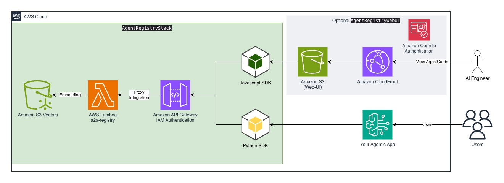

<h2 align="center">A2A Agent Registry on AWS</h2>
<p align="center">A scalable agent registry for discovering and managing AI agents using the A2A (Agent-to-Agent) protocol with semantic search capabilities.</p>

---

<p align="center">
  <a href="https://github.com/awslabs/a2a-agent-registry-on-aws"></a>
</p>

<p align="center">
  
  
</p>

<p align="center">
  
  
  
</p>

## 🔖 Features

- 🔍 **Semantic search** — Find agents using natural language queries powered by Amazon Bedrock Titan embeddings
- 🏷️ **Skill-based filtering** — Filter agents by specific skills using Amazon S3 Vectors metadata
- 📋 **A2A protocol compliant** — Full support for Agent-to-Agent protocol agent cards
- 🔐 **Secure by default** — IAM authentication on all API endpoints
- 🐍 **Python SDK** — Ready-to-use client library with retry logic and error handling
- 🌐 **Web interface** — React-based UI built with AWS Cloudscape Design System
- ☁️ **Serverless architecture** — Fully managed with AWS Lambda, API Gateway, and S3 Vectors

## What's the A2A Agent Registry? ❓

The A2A Agent Registry is a centralized service for registering, discovering, and managing AI agents. It enables agent-to-agent communication by providing a searchable catalog of agent capabilities.

Agents register their capabilities using standardized agent cards, and other agents or applications can discover them through semantic search or skill-based queries.

## 🎬 Web UI Demo


The demo showcases:
- **Register new agent** — Add agents with their capabilities and skills
- **See all agents** — Browse the complete list of registered agents
- **Search with plain text** — Find agents using natural language queries
- **Search by skill name** — Filter agents by specific skills

## 🏗️ Architecture



When you deploy `AgentRegistryStack`, you get an out-of-the-box agent registry:

- **API Gateway** — RESTful API with IAM authentication for secure access
- **Lambda** — Serverless compute handling agent CRUD operations and search queries
- **S3 Vectors** — Vector storage for agent embeddings enabling semantic search
- **Amazon Bedrock** — Titan embeddings model for converting agent descriptions to vectors

The **Python SDK** (`client/`) provides a ready-to-use client library with retry logic and IAM authentication.

Optionally, deploy `AgentRegistryWebUI` for a React-based web interface with Cognito authentication — connect it to your SSO provider or invite users directly from the Cognito console using their email address.

## 🚀 Quick Start

### Prerequisites

- AWS CLI configured with appropriate permissions
- Node.js 18+
- Python 3.11+

### Deploy

```bash
cd infrastructure
npm install
cdk deploy AgentRegistryStack
```

### Deploy Web UI (Optional)

```bash
# Build the React app first
cd web-ui
npm install
npm run build

# Deploy the Web UI stack
cd ../infrastructure
cdk deploy AgentRegistryWebUI
```

The Web UI stack deploys:
- S3 bucket for static hosting
- CloudFront distribution
- Cognito User Pool for authentication
- Cognito Identity Pool for AWS credentials

### Use the Python SDK

```python
from agent_registry_client import AgentRegistryClient
from a2a.types import AgentCard

client = AgentRegistryClient(api_gateway_url="https://your-api.execute-api.region.amazonaws.com/prod")

# Register an agent
agent_id = client.create_agent(AgentCard(
    name="My Agent",
    description="An agent that helps with tasks",
    version="1.0.0",
    url="https://my-agent.example.com"
))

# Search for agents
results = client.search_agents(query="help with tasks", skills=["python"])
```

## 📚 Documentation

| Document | Description |
|----------|-------------|
| [API Documentation](docs/api.md) | API endpoints, request/response formats |
| [Local Development](docs/local-development.md) | Setup local environment and run tests |
| [Python SDK](client/README.md) | Client SDK installation and usage |

## 📁 Project Structure

```
a2a-agent-registry-on-aws/
├── infrastructure/     # AWS CDK infrastructure
├── client/            # Python SDK
├── lambda/            # Lambda function code
├── web-ui/            # React web interface
└── docs/              # Documentation
```

## 🤝 Contributing

We welcome contributions! Please see our contributing guidelines for details.

## 📄 License

This project is licensed under the Apache 2.0 License.
